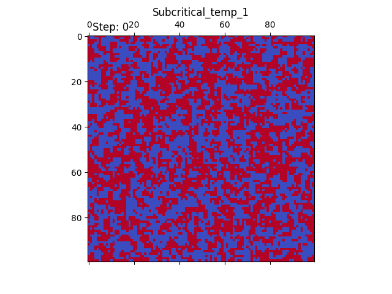
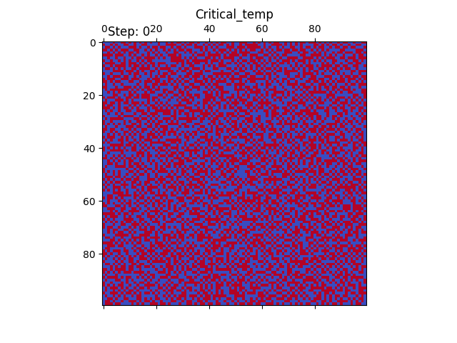
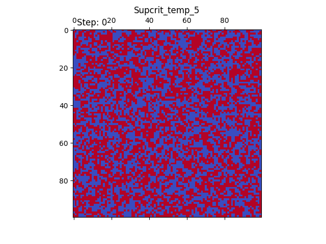

 When studying phase transitions it is useful to split them into two categories. We have the first-order transitions which are characterized by a sudden jump in temperature and energy, this energy is often referred to as latent heat. Secondly have the continuous phase transitions which requires no latent heat. It is worth pointing out that while the phase transitions themselves are continuous, their derivatives need not be.

Consider the [[Review on statistical mechanics#The Ising model |Ising model]] we recall from our discussion of the model that its Hamiltonian is given by
$$
H= - J \sum^N_{\braket{i j}}\sigma_i\sigma_j - h \sum_i^N\sigma_i.
$$
We define a partition function for some finite amount of lattice sites
$$
z = \exp(-\beta\varepsilon).
$$
I reemphasize for the sake of clarity, that $z$ is the partition function for a small subgroup of points rather then for the whole system, which is still denoted $Z$.

In the zero field limit $(h\to 0)$ we can choose $\varepsilon = J$ and the highest energy configuration (the one where all spins align) becomes
$$
\begin{align}
H &= \varepsilon \sum^N_{\braket{ij}} \sigma_i\sigma_j\\
  &= \varepsilon \sum^N_{\braket{ij}} 1\\
  &= \varepsilon \sum^N_{ij} \delta(1-|i-j|)\\
  &= \varepsilon 2N \quad\text{One } \forall\, i > j\text{, and one } \forall\, j > i.
\end{align}
$$
Each configuration contributes a power of $z$ to the partition function. So the partition function can be written as a polynomial of degree $2N$ in $z$.

The singularities of the free energy $(F)$ w.r.t. this polynomial can only happen at its roots. They all exist in the complex plane, which is comfortably out of reach for a finite number of nodes. However, as $N\to\infty$ the roots form curves of solutions which may intersect the real axis, and the critical behaviour takes place at those singularities.

Critical exponents are parameters that can characterize the phase transitions at these singularities. Temperature is often chosen as the quantity of interest to generalize said behaviour, but it need not be. There are other macroscopic parameters that can be used as well such as pressure or an external magnetic field.

The critical exponents are defined as follows
$$
\begin{align}
C &\sim |T-T_c|^{-\alpha},\\
M &\sim |T_c-T|^\beta,\\
\chi &\sim |T-T_c|^{-\gamma},\\
\text{and } \xi &\sim |T-T_c|^{-\nu}.
\end{align}
$$
Where $C$ is the specific heat, $M$ is the magnetization, $\chi$ is the susceptibility, and $\xi$ is the correlation length. The critical exponents are universal, meaning that they are independent of the microscopic details of the system.

Where the exponents used in above equations are given as fractions in the table below.
$$
\begin{array}{|c|c|c|c|}
\hline
\text{Quantity} & \text{Symbol} & \text{Critical exponent} & \text{Value} \\
\hline
\text{Specific heat} & C & \alpha & 0 \\
\text{Magnetization} & M & \beta & 1/8 \\
\text{Susceptibility} & \chi & \gamma & 7/4 \\
\text{Correlation length} & \xi & \nu & 1 \\
\hline
\end{array}
$$

### Scaling hypothesis
The critical exponents we have previously discussed can be related by a "scaling hypothesis".
$$
f(\lambda^a t, \lambda^b h) = \lambda f(t,h),
$$
i.e. there exsists exponents $a$ and $b$ such that the scaled parameters, $\lambda^a t$ and $\lambda^b h$, are related to the original parameters $t$ and $h$ by a scaled function $f$ dependant only on the unscaled parameters. The parameter $t$ is the reduced temperature, $t = (T-T_c)/T_c$, and $h$ is the external magnetic field which we are familiar with from our discussion of the [[Review on statistical mechanics#The Ising model |Ising model]]. The function $f$ in question is the free-energy-density or free-energy-per-site, depending on the weather the system one consider is continuous or discrete.

Lets consider the function $t^{-\frac1a}f(t,h)$, (from now on we will refer to $f(t,h)$ as $f$ for brevity), using the scaling hypothesis that is invariant under the scalings $t\to\lambda^a t$ and $h\to\lambda^b h$. We can write the function as
$$
\begin{align}
t^{-\frac1a}f(t,h) \to \left(\lambda^a t\right)^{-\frac1a}f(\lambda^a t,\lambda^b h) &= \left(\lambda^{-1}t\right)^{-\frac1a}\lambda f(t,h),\\
&= t^{-\frac1a}f(t,h).
\end{align}
$$

According to di Francesco et al. this is sufficient to conclude that the composite function $t^{\frac1a}f$ is dependant only on the scale invariant variable $y=\frac{h}{t^{b/a}}$. In other words
$$
t^{\frac1a}f = g(y).
$$

In the creation of this composite function we have used a small trick. Simply by solving for f we have heavily constrained its form.
$$
f = t^{-\frac1a}g(y).
$$

We will go on to investigate the macroscopic properties that are key to critical exponents.
Starting with spontaneous magnetization, it can be written as,
$$
\begin{align}
M &= -\frac{\partial f}{\partial h}\left |_{h=0}\right.;\\
  &= -\frac{\partial}{\partial h}\left(t^{-\frac1a}g\right)\left |_{h=0}\right.;\\
  &= -t^{-\frac1a}\frac{\partial y}{\partial h}\frac{\partial g}{\partial y}\left |_{h=0}\right.;\\
  &= -t^{-\frac1a}\frac1{t^{b/a}}\frac{\partial g}{\partial y}\left|_{h=0}\right.;\\
    &= -t^{-\frac{(b+1)}{a}}\frac{\partial }{\partial y}\left.\left(g(0) + g^\prime (0)y + \frac{g^{\prime\prime}(0)y^2}{2}+\dots \right)\right |_{h=0};\\
 &= -t^{-\frac{(b+1)}{a}}g^\prime(0). \text{ I am off by a minus sign. I can't tell where he gets it from.}
\end{align}
$$

The magnetic suceptibility can be written as
$$
\begin{align}
\chi &= \left.\frac{\partial M}{\partial h}\right |_{h=0};\\
    &= \left.-\frac{\partial^2}{\partial h^2} f\right |_{h=0};\\
    &= -t^{\frac1a}\frac{\partial}{\partial h}\left (\frac{\partial y}{\partial h}\frac{\partial g}{\partial y}\right)\left |_{h=0}\right.;\\
&= -t^{\frac1a}\frac{\partial }{\partial h}\left(\frac1{t^{b/a}}\frac{\partial g}{\partial y}\right)\left |_{h=0}\right.;\\
&= -t^{(1-b)/a}t^{-b/a}\frac{\partial^2 g}{\partial y^2}\left |_{h=0}\right.;\\
&= -t^{(1-2b)/a}\frac{\partial^2 }{\partial y^2}\left.\left(g(0) + g^\prime (0)y + \frac{g^{\prime\prime}(0)y^2}{2}+\dots \right)\right |_{h=0};\\
&= -t^{(1-2b)/a}g^{\prime\prime}(0).
\end{align}
$$

Lastly, the specific heat can be written as
$$
\begin{align}
C_v &= \left. -T\frac{\partial^2 f}{\partial T^2}\right |_{h=0}\\
    &= \left. -T\frac{\partial^2}{\partial T^2}t^{-\frac1a}g\right |_{h=0}\\
&= \left. -T\left(\frac{\partial t}{\partial T}\right)^2\frac{\partial^2  }{\partial t^2}t^{-\frac1a}g\right |_{h=0}\\
&= \left. -\frac{T}{T_c^2}\frac{\partial}{\partial t}\left(\frac{t^{\frac1a - 1}}{a}g + t^{\frac1a}\frac{\partial }{\partial t}g(y)\right)\right |_{h=0}\\
&= \left. -\frac{T}{T_c^2}\left[\left(\frac1a -1 \right)\left(\frac1a\right)t^{\frac1a - 2}g + \frac2at^{\frac1a - 1}\frac{\partial }{\partial t}g(y) + t^{\frac1a}\frac{\partial^2 }{\partial t^2}g(y)\right]\right |_{h=0}\\
\end{align}
$$

We proceed to compute the Jacobian of the transformation $t\to y$ is given by,
$$
\left(\frac{\partial t}{\partial y}\right) = -\frac{b h}{at^{\frac{b}{a}+1}}.
$$
This allows us to compute the derivative terms in the specific heat,
$$
\begin{align}
\left.\frac{\partial }{\partial t}g(y)\right |_{h=0} &= \left.-\frac{b h}{at^{\frac{b}{a}+1}}\frac{\partial }{\partial y}g(y)\right |_{h=0}\\
&= 0.
\end{align}
$$
The second derivative term is given by
$$
\begin{align}
\left.\frac{\partial^2 }{\partial t^2}g(y)\right |_{h=0} &= \left.\frac{\partial}{\partial t}\left(\frac{b h}{at^{\frac{b}{a}+1}}\frac{\partial }{\partial y}g(y)\right)\right |_{h=0}\\
&= \left. \frac{bh}{a}\left(\left(\frac{b}{a}-1\right) \frac{1}{t^{\frac{b}{a}-2}}\frac{\partial }{\partial y}g(y) - \frac{1}{t^{\frac{b}{a}-1}}\frac{\partial}{\partial y} g(y) \right)\right |_{h=0}\\
&= 0.
\end{align}
$$
Substituting these results back into the specific heat we find that the only part that survives is the first term, which is given by
$$
\begin{align}
C_v &= \left. -\frac{T}{T_c^2}\left[\left(\frac1a -1 \right)\left(\frac1a\right)t^{\frac1a - 2}g(y) + \frac2at^{\frac1a - 1}\frac{\partial }{\partial t}g(y) + t^{\frac1a}\frac{\partial^2 }{\partial t^2}g(y)\right]\right |_{h=0};\\
&= -\frac{T}{T_c^2}\left[\left(\frac1a -1 \right)\left(\frac1a\right)t^{\frac1a - 2}g(0)\right].\\
\end{align}
$$

The scaling hypothesis is an attempt at integrating two experimental results into one equation [Goldenfeld](#References), namely
$$
M(t, h=0) = \begin{cases}
0 & t > 0,\\
\pm A \left | t\right |^\beta  & t < 0.
\end{cases}
$$
And the behaviour along the critical isotherm, i.e. at the critical temperature, $t=0$, where
$$
M(t=0, h) = \pm B \left | h\right |^{1/\delta} .
$$
We know from previous calculationss that the magnetization is given by
$$
M(t, h) = -t^{-\frac{(b+1)}{a}}\frac{\partial}{\partial y}g(y).
$$
The combination with this equation and that we know the magentezation should be proportional to $M \propto t^\frac1\delta$ when $t\to 0$ allows us to make a few deductions. If t is to either diverge and be non-zero the exponents of $t$ must be equal to zero. Secondly, $\partial_y g(y)$ can be seen to take the following form
$$
\begin{align}
t^{-\frac{(b+1)}{a}}\frac{\partial}{\partial y}g(y) &\propto t^{\frac{1-b}{a}}(y^{\frac{1}{\delta}}) \text{ as } y\to\infty;\\
&=t^{\frac{1-b}{a}}\left(\frac{h}{t^{b/a}}\right)^{\frac{1}{\delta}};\\
&=t^{\frac{1-b}{a}}t^{-\frac{b}{a\delta}}h^{\frac{1}{\delta}};\\
&=t^{\frac{1-b-b/\delta}{a}}h^{\frac{1}{\delta}}.
\end{align}
$$
We first notice that with this form of $\partial_y g(y)$ the magnetization exhibits the correct proportionalities. Secondly, we can deduce that the exponent of $t$ must be zero, i.e. $1-b-b/\delta = 0$, or equivalently $\delta = \frac{b}{b-1}$. This is one out of four initial constraints that we can put on the critical exponents.

We find the rest of the constraints by observing that we already know the propotionalty relations for the susceptibility and the specific heat. We start by rewriting them in terms of $t$,
$$
\begin{align}
C &\propto \left | T - T_c\right |^{-\alpha} = T_c^{-\alpha}\left | \frac{T}{T_c} - 1\right |^{-\alpha} = T_c\left | t\right |^{-\alpha};\\
\chi &\propto \left | T - T_c\right |^{-\gamma} = T_c^{-\gamma}\left | -t\right |^{-\gamma};\\
M &\propto \left | T - T_c\right |^\beta = T_c^{\beta}\left | t\right |^\beta.
\end{align}
$$
Now in the $h\to 0$ limit, along the critical isotherm, we have the following relations
$$
\begin{align}
C &= -t^{\frac{1-b}{a}}g^\prime(0) \propto T_c^{-\alpha}\left | t\right |^{-\alpha};\\
\chi &= -t^{(1-2b)/a}g^{\prime\prime}(0) \propto T_c^{-\gamma}\left | t\right |^{-\gamma};\\
M &= -t^{-\frac{(b+1)}{a}}g^\prime(0) \propto T_c^{\beta}\left | t\right |^\beta.
\end{align}
$$

Leading to the total set of constraints
$$
\begin{align}
\alpha &= -\frac{1-b}{a};\\
\beta &= -\frac{b+1}{a};\\
\gamma &= -\frac{1-2b}{a};\\
\delta &= \frac{b}{b-1}.
\end{align}
$$

### Hypercubic lattice
We can further constrain the critical exponents by considering the hypercubic lattice, see figure below.

In this new system we treat each block as a spin onto itself.
Each block has a side $r$ in units of lattice spacing. It is worthwile to make sure that one understands this definition of lattice spacing properly, as many of the steps and definitions to come turn out quite natural from it.
A cube of "lattice spacing length" $(r=1)$ is a single point,

; $r=1$.
And a cube with side length $r=2$ looks like,
; $r=2$.
It then follows immediately, if $d$ is the dimmension of the lattice, there are $r^d$ different spins within a block.
Each spin within a block can take on values in $\{-1, 1\}$ just like before. This gives us a natural way to define a block spin,
$$
\sigma_I =\frac1{R} \sum_{i\in I} \sigma_i,
$$
where $I$ is the sites within a block and $R$ is a normalizing factor, which job it is to ensure that the block spin $\sigma_I$ takes on a effective value of 1 or -1.

Consider now the correlation function, $\Gamma(i-j)$ which we have defined in the [[Review on statistical mechanics | Review on statistical mechanics]] as,
$$
\Gamma(i-j) = \left<\sigma_i\sigma_{j}\right> - \left<\sigma_i\right>\left<\sigma_{j}\right>.
$$

It is common to refer to $\Gamma(i-j)$ as simply $\Gamma(n)$ where $n = i-j$ is the distance between the spins. We can now define the correlation function for the block spins as,
$$
\begin{align}
\Gamma(n) &= \left<\sigma_I\sigma_{J}\right> - \left<\sigma_I\right>\left<\sigma_J\right>;\\
&= \frac1{R^2}\sum_{i,j\in I,J}\left\{\left<\sigma_i\sigma_j\right> - \left<\sigma_i\right>\left<\sigma_j\right>\right\};\\
&= \frac1{R^2}r^{2n}\sum_{i,j\in I, J}\left\{\frac{\left<\sigma_i\sigma_j\right> - \left<\sigma_i\right>\left<\sigma_j\right>}{r^{2n}}\right\};\\
&= \frac1{R^2}r^{2n}\Gamma(rn).
\end{align}
$$
Here, we have normalized the pair correlator function with the number of spins within a block. In other words we are taking the pair correlator of not $i-j$ but of the scaled-up distance $rn$.

We also know the proportionality relation for the correlation function,
$$
\Gamma(n) \propto \left | n\right |^{2 -d -\eta}.
$$
This has the consequence for the block correlator that
$$
\begin{align}
\Gamma^\prime(n) &\propto R^{-2}r^{2d}\left | rn\right |^{2 -d -\eta};\\
&= R^{-2}r^{2+d-\eta}\left | n\right |^{2 -d -\eta};\\
\end{align}
$$

Now imposing the same proprtionality relation to $\Gamma^\prime(n)$ as we did for $\Gamma(n)$ we find that terms other than $|n|^{2-d-\eta}$ must vanish. This gives us the constraint
$$
\begin{align}
R^{-2}&r^{2+d-\eta} = 1.\\
R^{-2} &= r^{-2-d+\eta}\\
R &= r^{(2+d-\eta)/2}.
\end{align}
$$

Now consider the block hamiltonian, $H^\prime$. It should involve the same interaction energy as the normal hamiltonian $(H)$, with the external field and therefore we have,
$$
\begin{align}
h\sum_I\sigma_i &= h^\prime\sum_I\Sigma_i;\\
&=h^\prime R^{-1}\sum_I\sigma_i;\\
\end{align}
$$
which implies
$$
h^\prime = hR.
$$
which we now know is
$$
h^\prime = hr^{(2+d-\eta)/2}.
$$

We can then use the scaling hypothesis, i.e.,$h^\prime = h\lambda^b$ and letting the side length of the block be $r = \lambda^\frac1d$ (implying that the number of spins within a block is just $\lambda$). Gives us the following connection
$$
\begin{align}
h\lambda^b &= hr^{(2+d-\eta)/2};\\
&= h\lambda^{\frac{2+d-\eta}{2d}};\\
\implies b &= \frac{2+d-\eta}{2d}.
\end{align}
$$

Now if we consider the correlation length for the block model $(\xi^\prime)$, it is natural to define in terms of the old correlation length $(\xi)$ as
$$
\xi^\prime = \xi/r.
$$
Using the proportionality relation once more allows us to show
$$
\begin{align}
\xi^\prime \propto \left | t\right |^{-\nu};\\
\frac\xi r \propto \left | t\right |^{-\nu}.\\
\xi \propto r\left | t\right |^{-\nu};\\
\implies rt^{\prime-\nu} = t^{-\nu};\\
t^{\prime} = t r^{\frac1\nu}.
\end{align}
$$
Now turning once more to the scaling hypothesis we know
$$
\begin{align}
t^\prime &= t\lambda^a;\\
\lambda^a &= r^{\frac1\nu};\\
&= \lambda^{\frac1{d\nu}};\\
\end{align}
$$
which of course tells us that $a = \frac1{d\nu}$. We have then successfully expressed our previous critical exponents $(\alpha \text{ through } \delta)$ in terms of the new critical exponents $(\eta, \nu)$ and the dimension of the lattice $(d)$. Continuing where we left of with our previous set of constraints we can now write them as
$$
\begin{align}
\alpha &= 2 - d\nu;\\
\beta &= \frac\nu2\left( d - 2 + \eta\right);\\
\gamma &= \frac{2-\eta}{\nu};\\
\delta &= \frac{d+2-\eta}{d-2+\eta}.
\end{align}
$$
These equations have historical names and are all presented in their historical form in the table below.
$$
\begin{array}{c c}
\hline
\text{Rushbrooke's law} & \alpha + 2\beta + \gamma = 2;\\
\text{Widom's law} & \gamma = \beta(\delta - 1);\\
\text{Fisher's law} & \gamma = \nu(2-\eta);\\
\text{Josephson's law} & \nu\delta = 2 - \alpha;\\
\hline
\end{array}
$$

### Broken symmetry
As we know from Noethers theorm, conserved quantities are related to symmetries of the action, or int the case of classical systems; the configuration energy. It can be said that such a system is broken when macroscopic quantities, which do not respect this symmetry have non-vanishing expectation values. An easy example of this is given by the 2-d Ising model with zero external magnetic field. It is easy to see, as we have seen in [[Review on statistical mechanics#The Ising model | Ising model]], that the energy is invariant under the transformation $\sigma_i\to -\sigma_i$. The magnetization for this however does not vanish in the sub-critical regime. This can be easaly seen by considering the magnetization as a function of the temperature, $M(T)$. It is easy to see from a simulation of the Ising model below,

| Sub-critical                                            | Critical                                             | Super-critical                                            |
| ------------------------------------------------------- | ---------------------------------------------------- | --------------------------------------------------------- |
|  |  |  |

Here a blue tile represents spin down and a red tile represents a spin up at the vertex. Clearly the expectation value is negative in this regime.

We can also see that the magnetization does not reflect the same symmetry seeing as from [[Review on statistical mechanics| Review on statistical mechanics]] we know that the magnetization is given by
$$
\begin{align}
M &= \frac1{NZ}\sum_{\[\sigma\]}\sum_i\left\{\sigma_i \right\}\exp(-\beta E[\sigma]).\\
&\to-M \text{ under the transformation }\sigma_i\to -\sigma_i.
\end{align}
$$
Where $Z$ is a function of the configuration energy, $E[\sigma]$, which we know itself is invariant under the transformation $\sigma_i\to -\sigma_i$. This allows us to conclude that the magnetization is a non-zero quantity in the sub-critical regime.

Before we end this section it is worth briefly mentioning the MWC (Mermin Wagner Coleman) theorem. This theorem addresses continuum models. These models does not admit discrete but rather continuous symmetries. The MWC theorem states that it is not possible to break the symmetry of continuous models in one or two dimensions. You can read more about the MWC theorem in section 11.1 of [Goldenfeld](#References) and Wikipedia also has a good article on the subject [here](https://en.wikipedia.org/wiki/Mermin%E2%80%93Wagner_theorem).

We continue our discussion in the next section where we will discuss the renormalization group [[Review on renormalization group | Renormalization group]].

************
# References
1. Di Francesco, P., Mathieu, P., & Senechal, D. (1997). Conformal Field Theory. Springer-Verlag Berlin Heidelberg.
2. Goldenfeld, N. (1992). Lectures on Phase Transitions and the Renormalization Group. Addison-Wesley Publishing Company.

