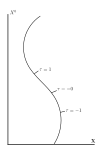
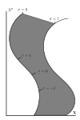

In this note, and subsequent notes relating to the topic of string theory, it is the ambition to review briefly. This review will therefore not be comprehensive at all. We recommend [1, 2](#References) if the reader is looking for a more comprehensive treatment.

#### Conspectus
To better understand strings, it is useful to first understand it lower-dimensional little brother. The particle. Consider a particle living in a $D$-dimensional flat spacetime with metric
$$
\eta = \text{diag}(-,+,\dots,+).
$$
The position of said particle can be traced out with $D-1$ equations as a function of time $(\mathbf X(X_0))$. This formalism, however, does not make it clear that the path is independent of the parametrization. To make this fact more readily apparent, we can instead parameterize the path in terms of the particles perceived time, $\tau$. Consider the following diagram.

Now instead of a particle, consider a string of length $\ell$. The string will trace out a 2-dimensional sheet through space-time.

The sheet in question is referred to as the world-sheet. Here, we introduce the coordinate $\sigma$ to be the position coordinate on the world sheet.

The simplest Poincare invariant action is
$$
S_{\rm pp} = -m \int d\tau \left(-\dot X^\mu \dot X_\mu\right)^{1/2},
$$
where the dot indicates a derivative in $\tau$.

The variation of the action becomes
$$
\begin{align}
\delta S_{\rm pp} &= -m \int d\tau \delta \left(-\dot X^\mu \dot X_\mu\right)^{1/2} \\
&= - \frac{m}{2} \int d\tau \left(-\dot X^\mu \dot X_\mu\right)^{-1/2} \left(-\delta\dot X^\mu  \dot X_\mu - \dot X^\mu \delta \dot X_\mu\right) \\
&= - \frac{m}{2} \int d\tau \left(-\dot X^\mu \dot X_\mu\right)^{-1/2} \left(-2\dot X^\mu \delta \dot X_\mu\right) \\
\end{align}
$$
We define the term $u$ for the time being, waiting to comment on its physical significance.
$$
u^\mu = \dot X^\mu \left(-\dot X^\nu\dot X_\nu\right)^{-1/2},
$$
with $u$ we can write the action as
$$
\begin{align}
\delta S_{\rm pp} &= m \int d\tau \dot X^\mu \left(-\dot X^\mu \dot X_\mu\right)^{-1/2} \delta \dot X_\mu \\
\delta S_{\rm pp} &= m \int d\tau u^\mu \delta \dot X_\mu \\
\delta S_{\rm pp} &= m \left\{\left[ d\tau u^\mu \delta  X_\mu\right]^{\infty}_{-\infty} -\int d\tau \dot u^\mu \delta  X_\mu \right\}\\
\delta S_{\rm pp} &= m -\int d\tau \dot u^\mu \delta  X_\mu \\
\end{align}
$$

#### References
1. [Polchinski J. String Theory (vol. 1)](10.1017/CBO9780511816079)
2. [Polchinski J. String Theory (vol. 2)](10.1017/CBO9780511618123)

